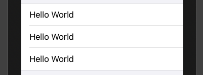
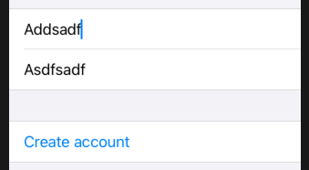

# Form

A container for grouping controls used for data entry, such as in settings or inspectors



```swift
var body: some View {
    Form {
        Text("Hello, world!")
        Text("Hello, world!")
        Text("Hello, world!")
    }
}
```

You can show up to ten rows in a form. After that you will have to group. This is by design - parents can only support then children.

```swift
var body: some View {
    Form {
       Group {
         Text("Hello, world!")
         Text("Hello, world!")
         Text("Hello, world!")
         Text("Hello, world!")
         Text("Hello, world!")
       }
       Group {
         Text("Hello, world!")
         Text("Hello, world!")
         Text("Hello, world!")
         Text("Hello, world!")
         Text("Hello, world!")
       }
    }
}
```

Groups don't actualy change the way our user interface looks, they just let us work around SwiftUI's limitation of ten child views inside a parent - that's text views indside a form, in this instance.

## Section

```swift
Form {
    Section {
        Text("Hello World")
    }
    Section {
        Text("Hello World")
        Text("Hello World")
    }
}
```

## Diable

Use `.disabled()` modifier.



```swift
struct ContentView: View {
    @State private var username = ""
    @State private var email = ""

    var body: some View {
        Form {
            Section {
                TextField("Username", text: $username)
                TextField("Email", text: $email)
            }
            Section {
                Button("Create account") {
                    print("Creating account...")
                }
            }
            .disabled(disableForm)
        }
    }
    var disabledForm: Bool {
        username.count < 5 || email.count < 5
    }
}
```

## Links that helps

- [Creating a form](https://www.hackingwithswift.com/books/ios-swiftui/creating-a-form)
- [Disabling forms](https://www.hackingwithswift.com/books/ios-swiftui/validating-and-disabling-forms)
