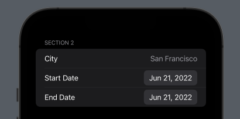
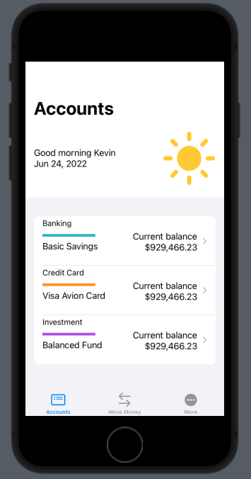
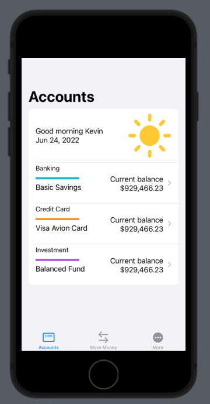
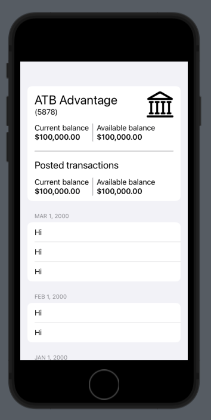
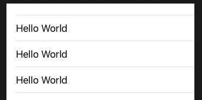
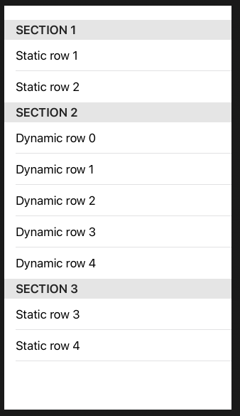
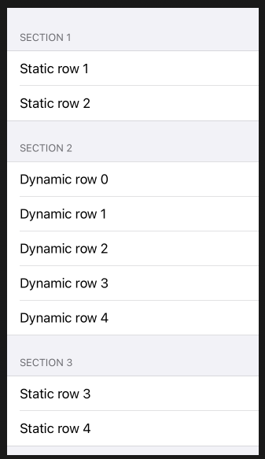
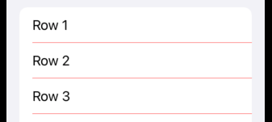

# Lists

Lists are great. You can throw anything in there and it will be scrollable:



```swift
struct TripDetailsView: View {
    var body: some View {
        List {
            Section(header: Text("Section 2")) {
                CityRow()
                DateRow(titleKey: "Start Date")
                DateRow(titleKey: "End Date")
            }
        }
    }
}
```

## Headers

If you want a non-scrollable header, leave it outside the list:



```swift
NavigationStack {
    AccountHeader()
        .padding()
    List(modelData.accounts) { account in
        NavigationLink(value: account) {
            AccountRow(account: account)
        }
    }
}
```

If you want to scroll with the list, put it inside and add the rows with a ForEach:


```swift
NavigationStack {
    List {
        AccountHeader()
        ForEach(modelData.accounts) { account in
            NavigationLink(value: account) {
                AccountRow(account: account)
            }
        }
    }
}
```

`ForEach` is your friend for dynamically building views inside your `List`:


```swift
List {
    VStack(alignment: .leading) {
        AccountDetailHeader(account: account)
        AccountDetailHeaderBalance()
    }
    ForEach(modelData.sortedTxSections) { section in
        Section(header: Text(section.title)) {
            ForEach(section.transactions) { tx in
                Text("Hi")
            }
        }
    }
}
```

## Section header styling

You can style your headers like this:


```swift
Section(header: Text("Section 2")) {
    Text("Row")
}
.headerProminence(.increased)
```

## Examples

provides a scrollable table of data. Very similar to `Form`, except it's used for presentation of data rather than requesting user input.



```swift
List {
    Text("Hello world")
    Text("Hello world")
    Text("Hello world")
}
```



```swift
List {
    Section(header: Text("Section 1")) {
        Text("Static row 1")
        Text("Static row 2")
    }
    Section(header: Text("Section 2")) {
        ForEach(0..<5) {
            Text("Dynamic row \($0)")
        }
    }
    Section(header: Text("Section 3")) {
        Text("Dynamic row 1")
        Text("Dynamic row 2")
    }
}
```


`.listStyle(GroupListStyle())`

## ID

when working with arrays of data SwiftUI needs to know how to identify each row uniquely, so if one gets removed it can simply remove that one rather than having to redraw the whole list. This is where the `id` parameter comes in, and it works identically in both `List` and `ForEach`.

When working with arrays of strings and numbers, the only thing that makes those values unique is the values themselves. That is, if we had the array [2,4,6,8,10], then those numbers themselves the unique identifiers. After all, we don't have anything else to work with.

When working with this kind of list data, we use `id: .self` like this

```swift
struct ContentView: View {
    let people = ["Finn", "Leia", "Luke", "Rey"]
    var body: some View {
        List(people, id: \.self) {
            Text($0)
        }
    }
}
```

Works the same with `ForEach`.

```swift
List {
    ForEach(people, id: \.self) {
        Text($0)
    }
}
```

## List Styles

### automatic | grouped | inset | insetGrouped | plain | sidebar

```swift
struct ContentView: View {
    var body: some View {
        List(1..<20) {
            Text("\($0)")
        }.listStyle(.automatic)
    }
}
```

## listRowSeparator

```swift
struct ContentView: View {
    var body: some View {
        List {
            ForEach(1..<100) { index in
                Text("Row \(index)")
                    .listRowSeparatorTint(.red)
            }
        }
    }
}

struct ContentView_Previews: PreviewProvider {
    static var previews: some View {
        ContentView()
    }
}
```



Links that help:

- https://github.com/jrasmusson/swiftui/blob/main/Controls/Lists/README.md
