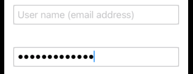

# Secure Field



```swift
import SwiftUI


struct ContentView: View {
    @State private var username: String = ""
    @State private var password: String = ""

    var body: some View {
        TextField("User name (email address)")
            .autocapitalization(.none)
            .disableAutocorrection(true)
            .textFieldStyle(.rounded)
            .boarder(Color(UIColor.separator))
            .padding()
        SecureField("Password", text: $password) {
            handleLogin(username: username, password: password)
        }
            .border(Color(UIColor.separator))
            .textFieldStyle(RoundedBoarderTextFieldStyle())
            .padding()
    }
}
struct ContentView_Previews: PreviewProvider {
    static var previews: some View {
        ContentView()
    }
}
```

## Links that helps

- https://developer.apple.com/documentation/swiftui/securefield
