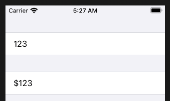
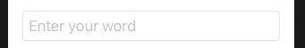

# TextField

You create a text field with a label and a binding value. Text field also provide two closures. `editingChanged` and `onCommit`.

```swift
TextField("Search", text: $cityName) { isEditing in
    // do something
} onCommit: {
    // do something
}

TextField("Search", text: $cityName, onCommit: {
    // do something
})


TextField("Search", text: $cityName)
    .font(.title)
    .padding(8)
    .backgroud(Color(.systemFill))
        .cornerRadius(10)
    .keyboardType(.asciiCapable)
```



```swift
struct ContentView: View {
    var body: some View {
        Form {
            Section {
                TextField("Amount", text: $checkAmount)
                    .keyboardType(.decimalPad)
            }
            Section {
                Text("$\(checkAmount)")
            }
        }
    }
}
```

## Placeholder Text

```swift
TextField("placeholder goes here": , text: $newWord)
```

## TextFieldStyle

### RoundedBorderTextFieldStyle



```swift
.textFieldStyle(.roundedBoarded)
.padding()
```


```swift
.textFieldStyle(.plain)
```

## Turn off autocapitalization

```swift
.autocapitalization(.none)
```

## Set background color


```swift
TextField("Search", text: $cityName)
    .font(.title)
    .padding(8)
    .background(Color(.systemFill))
        .cornerRadius(10)
    .keyboardType(.asciiCapable)
```

## Keyboard dismall and focus

Here is my focus state. when true it will focus my thing. when unfocused it will hide keyboard

```swift
struct ContentView: View {
    @State private var name = ""
    @FocusState private var nameIsFocused: Bool

    var body: some View {
        VStack {
            TextField("Enter your name", text: $name)
                .focused($nameIsFocused)
            Button("Submit") {
                nameIsFocused = false
            }
        }
    }
}

struct ContentView_Previews: PreviewProvider {
    static var previews: some View {
        ContentView()
    }
}
```

Something slightly more complicated

```swift
import SwiftUI

struct ContentView: View {
        enum Field {
            case firstName
            case lastName
            case emailAddress
        }
        @State private var firstName = ""
        @State private var lastName = ""
        @State private var emailAddress = ""
        @FocusState private var focusedField: Field?

    var body: some View {
        VStack {
            TextField("Enter your first name", text: $firstName)
                .focused($focusedField, equals: .firstName)
                .textContentType(.givenName)
                .submitLabel(.next)
            TextField("Enter your last name", text: $lastName)
                .focused($focusedField, equals: .lastName)
                .textContentType(.familyName)
                .submitLabel(.next)
            TextField("Enter your email address", text: $emailAddress)
                .focused($focusedField, equals: .emailAddress)
                .textContentType(.emailAddress)
                .submitLabel(.join)
        }
        .onSubmit {
            // figure out where we are and moved on to the next field
            switch focusedField {
                case .firstName:
                    focusedField = .firstName
                case .lastName:
                    focusedField = .emailAddress
                default:
                    print("joining chat room...")
            }
        }
    }
}

struct ContentView_Provider: PreviewProvider {
    static  var previews: some View {
        ContentView()
    }
}
```

## Links that help

- https://developer.apple.com/documentation/swiftui/textfield
