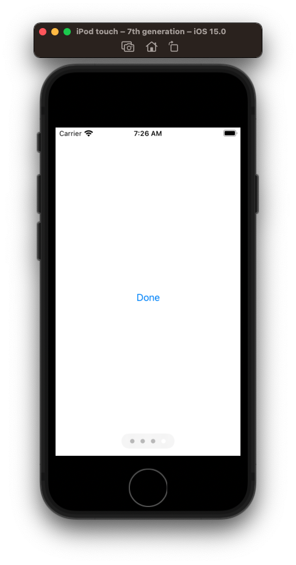
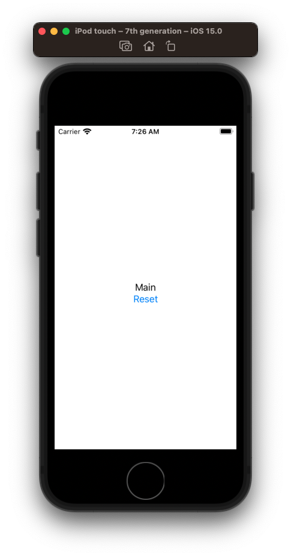

# How to navigate from one view flow to another

say you want to go through onboarding flow



and once complete switch over to main view



Define and `ObservableObject` called `AppState` and pass it down as `EnvironmentObject` to all your subviews.

```swift
import SwiftUI

// Define your observable
class AppState: ObservableObject {
    @Published var hasOnboarded: Bool

    init(hasOnboarded: Bool) {
        self.hasOnboarded = hasOnboarded
    }
}

// load it onto your app
@main
struct DemoApp: App {
  @StateObject var appState = AppState(hasOnboarded: false)

  var body: some View {
    WindowGroup {
      if appState.hasOnboarded {
        MainFlowView()
          .environmentObject(appState)
      } else {
        OnboardingFlowView()
          .environmentObject(appState)
      }
    }
  }
}

struct OnboardingFlowView: View {
  @EnvironmentObject var appState: AppState

  var body: some View {
    TabView {
      Text("First")
      Text("Second")
      Text("Third")
      Button("Done") {
        appState.hasOnboarded = true // change
      }
    }
    .tabViewStyle(.page)
    .indexViewStyle(.page(backgroundDisplayMode: .always))
  }
}

struct MainFlowView: View {
  @EnvironmentObject var appState: AppState

  var body: some View {
    VStack {
      Text("Main")
      Button("Reset") {
        appState.hasOnboarded = false
      }
    }
  }
}
```
