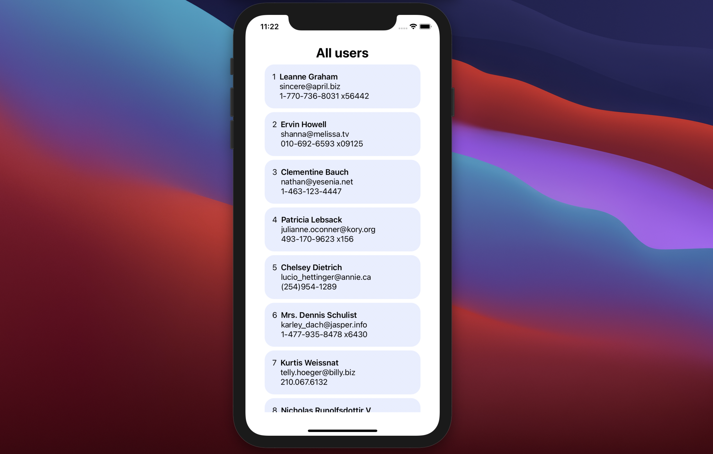

# https://designcode.io/swiftui-advanced-handbook-http-request

https://designcode.io/swiftui-advanced-handbook-http-request



```swift
// Network.swift
import SwiftUI

class Network: ObservableObject {
    @Published var users: [User] = []

    func getUsers() {
        guard let url = URL(string: "https://jsonplaceholder.typicode.com/users") else { fatalError("Missing URL") }
        let urlRequest = URLRequest(url: url)

        let dataTask = URLSession.shared.dataTask(with: urlRequest) {(data, response, error) in
            if let error = error {
                print("request error", error)
                return
            }
            guard let response = response as? HTTPURLResponse else {return}

            if response.statusCode == 200 {
                guard let data = data else {return}
                DispatchQueue.main.async {
                    do {
                        let decodedUsers = try JSONDecoder().decode([User].self, from: data)
                        self.users = decodedUsers
                    } catch let error {
                        print("Error decoding", error)
                    }
                }
            }
        }
        dataTask.resume()
    }
}

```

**ContentView**

```swift
import SwiftUI

struct ContentView: View {
    @EnvironmentObject var network: Network

    var body: some View {
        ScrollView {
            Text("All users")
                .font(.title)
                .bold()
            VStack(alignment: .leading) {
                ForEach(network.users) { user in
                    HStack(alignment: .top) {
                        Text("\(user.id)")

                        VStack(alignment: .leading) {
                            Text(user.name)
                                .bold()
                            Text(user.email.lowercased())
                            Text(user.phone)
                        }
                    }
                    .frame(width: 300, alignment: .leading)
                    .padding()
                    .background(Color(#colorLiteral(red: 0.6667672396, green: 0.7527905703, blue: 1, alpha: 0.2662717301)))
                    .cornerRadius(20)
                }
            }
        }
        .padding(.vertical)
        .onAppear {
            network.getUsers()
        }
    }
}

struct ContentView_Previews: PreviewProvider {
    static var previews: some View {
        ContentView()
            .environmentObject(Network())
    }
}
```
